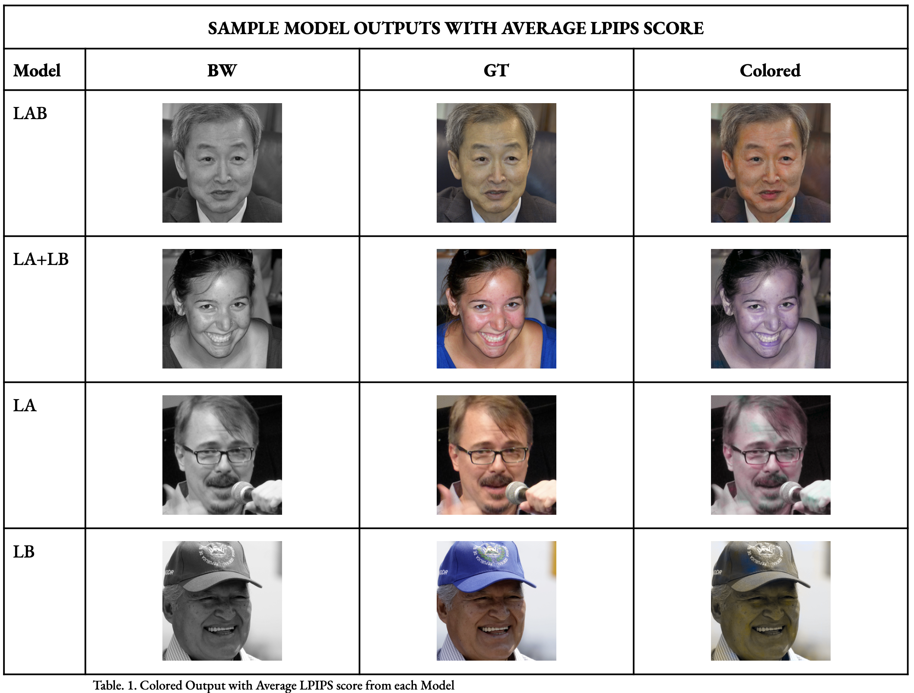

# Deep Learning Image Colorization (U-Net & LAB)



### 1. About The Project

This project explores the impact of training separate chrominance channels on the accuracy of image colorization. By utilizing a modified U-Net architecture, we tested whether splitting the LAB color space into separate training tasks (predicting 'A' and 'B' channels independently) yields higher accuracy than training on the unified LAB space.

The model was trained on a subset of the FFHQ dataset (20,000 images), using LPIPS (Learned Perceptual Image Patch Similarity) to evaluate perceptual realism against Ground Truth.

**[📄 Click Here to Read the Full Report (PDF)](ML_Project_Report.pdf)**

#### Key Features
- **Custom U-Net Architecture:** Built from scratch to handle LAB color space tensors.
- **Split-Channel Training:** Unique experimentation with `LA` (Lightness + Green/Red) and `LB` (Lightness + Blue/Yellow) models.
- **Ensembling:** Post-processing scripts to combine independently trained channels.
- **Comparative Analysis:** Automated evaluation pipelines comparing 4 distinct model configurations.


### 2. Installation

1. Clone the repository:
   ```bash
   git clone https://github.com/luclacombe/Ensemble-UNet-Colorization.git
   ```

2. Install the dependencies:
   ```bash
   pip install -r requirements.txt
   ```

### 3. How to Use

To replicate the results, follow the pipeline below.

### Step 1: Data Setup
- Ensure your data is organized in the `data/` directory.
- Place black & white input images in `data/BW/`. Name files appropriately (see example in `data/BW/`).
- Place ground truth color images in `data/Col/`. Name files appropriately (see example in `data/Col/`).

### Step 2: Generate Colorizations
The model requires you to specify the training mode manually before execution.

#### A. Generate LA (Lightness + A channel)
1. Open `main.py` in your text editor.
2. Set the variable `MODE = "LA"`.
3. Run the script:
   ```bash
   python main.py
   ```

#### B. Generate LB (Lightness + B channel)
1. Open `main.py` and change to `MODE = "LB"`.
2. Run the script again.

#### C. Generate LAB (Unified Baseline)
1. Open `main.py` and change to `MODE = "LAB"`.
2. Run the script again.

### Step 3: Ensemble
Combine the outputs from the split-channel models (LA and LB) into a final image (LA + LB).
```bash
python ensemble.py
```

### Step 4: Evaluation

**Calculate Metrics:**
Run the metrics script to compare all generated outputs against Ground Truth.
```bash
python evaluate_metrics.py
```
*(Outputs a CSV file)*

**Visualize Results:**
Generate graphs from the CSV data.
```bash
python evaluate_plots.py
```

### 4. Credits

**Machine Learning Final Project Members:**
- [Luc Lacombe](https://www.linkedin.com/in/luc-c-lacombe-714609254/)
- [Alpdeniz Sarici Hernandez](https://www.linkedin.com/in/alpdenizsaricihernandez/)
- [Ali Muftu](https://www.linkedin.com/in/ali-muftu-709158259/)
- [Andy Popov](https://www.linkedin.com/in/andy-popov-71b242251/)
